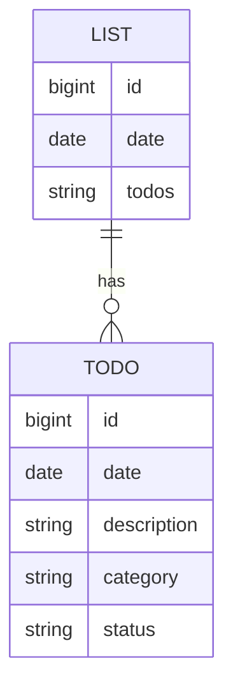

# Quotidian Backend
This is the API/backend for [Quotidian](https://github.com/cinduhrz/Project4-Quotidian-frontend), a full CRUD app for keeping track of your daily to-do lists. Built on a Django backend (with a postgreSQL database) and React frontend, Quotidian keeps track of all your day's to-do's, reminders, and events on a single list. A special section for all the things you've put the backburner persists throughout each note until you check it off - taking up less space in your brain, because you can rest assured you won't forget about them. With Quotidian, you'll always know exactly what you need to do and remember, everyday.

#### Technologies Used
- Django
- Python
- PostgreSQL
- Render

### Models

#### Backend Route Table
| Route Name |     URL    | HTTP Verb |        Description         |
|------------|------------|-----------|----------------------------|
|   Index    | /todos     |    GET    | Displays list of todos     |
|   Show     | /todos/:id |    GET    | Shows a specific todo      |
|   Create   | /todos     |    POST   | Adds new todo to database  |
|   Update   | /todos/:id |    PUT    | Updates a specific todo    |
|   Delete   | /todos/:id |   DELETE  | Deletes a specific todo    |

### API
[Deployed Backend Link](https://quotidian-backend.onrender.com)

#### User Stories
- As a user, I can see a list of my todos.
- As a user, I can see a specific todo.
- As a user, I can create a new todo.
- As a user, I can update a todo.
- As a user, I can delete a todo.